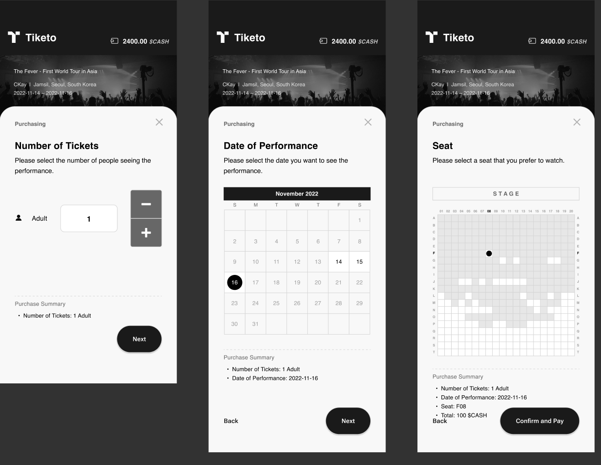

# Tiketo
#### Fair Ticket Platform to Prevent Ticket-Scalping

Deployed Link: [Here](https://transcendent-elf-7b840a.netlify.app/)
 
(It is available in the **mobile** environment, and Kakaotalk should be installed to connect with **Klip wallet**.)

DoraHacks Link: [Here](https://dorahacks.io/buidl/3593)

Mainly Used **React**, **Redux**, **Klip API([Link](https://docs.klipwallet.com/))**,  **Caver.js([Link](https://ko.docs.klaytn.foundation/dapp/sdk/caver-js))**

Lesson I learned(KOR): [Here](https://syjn99.notion.site/Tiketo-89703e819a6a47a48f007a3b75223dea)

